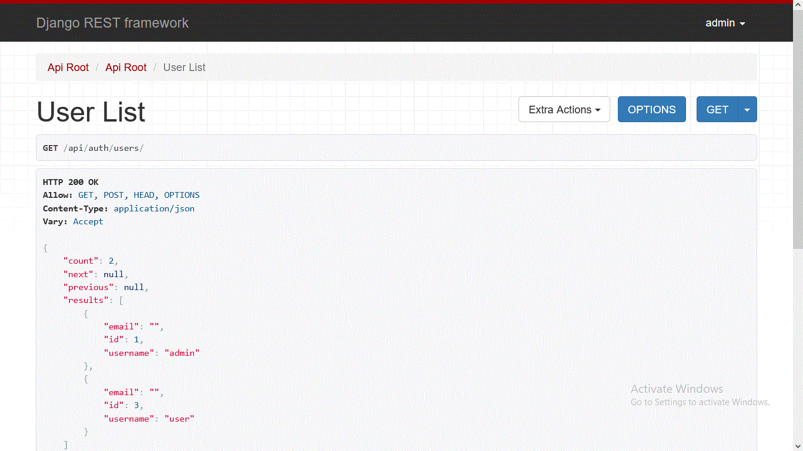
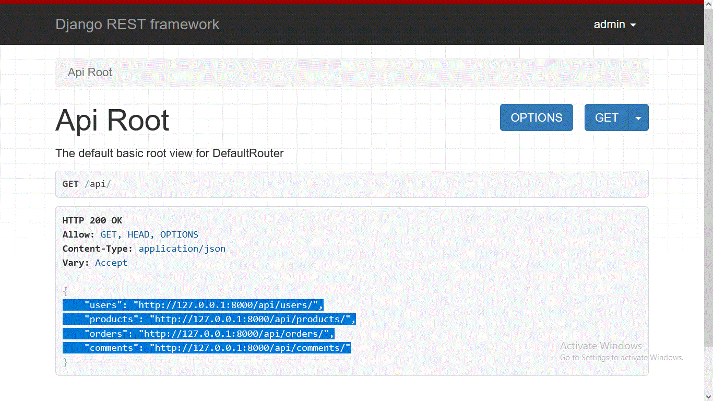
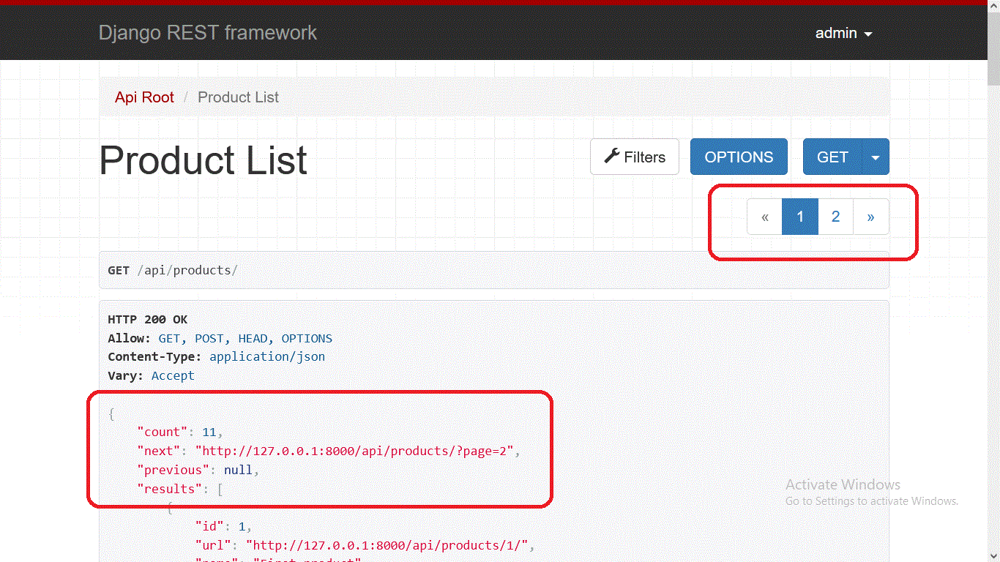
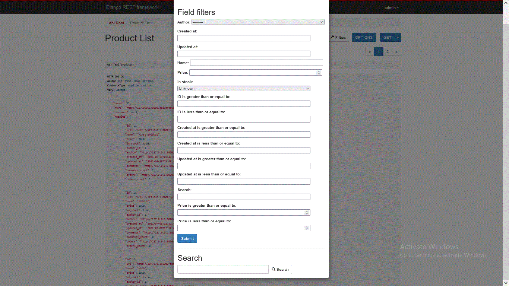
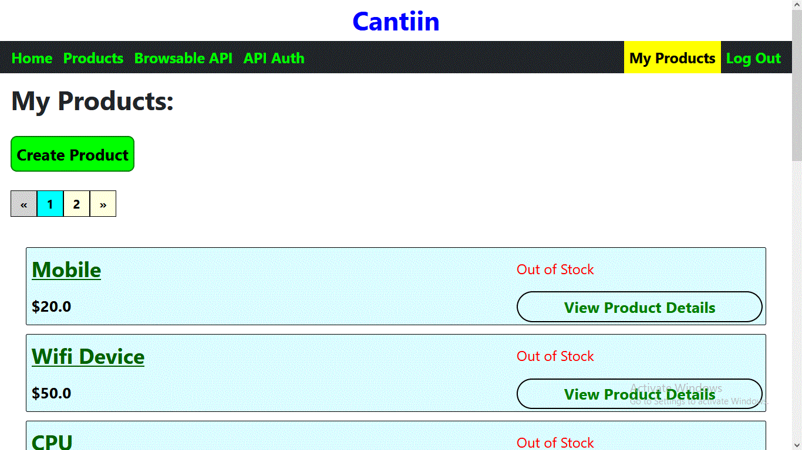

# cantiin_django
An ecommerce RESTful API using django and Django REST Framework.


# A) Technologies Used:
1. Python
2. Django
3. Django REST Framework
4. Djoser (Header Auth)
5. django_filter


# B) How to Run:

```bash
cd _app
pip install -r requirements.txt
python manage.py migrate
python manage.py runserver
```


# C) Backend:

## C-1) Authentication:

The system uses Django authentication system.  
To use the authentication system you can use this link:
http://127.0.0.1:8000/api/auth/users/  
Here there are djoser endpoints.
This is a the <a href="https://djoser.readthedocs.io/en/latest/base_endpoints.html">documentation</a> of these endpoints.  



The endpoints of authentication are there.  
Authentication is made by cookie if you want to extend the application using the same origin.  
And it also uses auth header if you want to extend the application 
with different origin.  
Authentication uses JWT.


## C-2) What the app does:

Beyound authentication, the app has three more models.  
- Product (Where the users can handle products)
- Order (Where the user can orders of products)
- Comment (Where the user can handle comments on products)


These are the endpoints of API recources:  
"users": "http://127.0.0.1:8000/api/users/" (This is different from auth endpoints)  
"products": "http://127.0.0.1:8000/api/products/"  
"orders": "http://127.0.0.1:8000/api/orders/"  
"comments": "http://127.0.0.1:8000/api/comments/"




## C-3) Pagination:
All the models have pagination.  
Since it exists in the `settings.py` file.  
The pagination uses pages.  
Each page has 10 records.  





## C-4) Validation and Sanitization:
Validation and is used here, it is built in django  and Django REST framework.  
Because we are using Django REST Framework serialization.  
When the user sends a wrong request, the correct response will be returned.


## C-5) Rate Limit:
It means the limit of requests that can be sent bu the users.  
It is very helpful to prevent DoS attacks.  
For users that are 
- logged in: 1000 request/min/IP Adress
- not logged in: 100 request/min/Users


These can be changed by changing `settings.py`.

## C-6) Permissions:
- Not Logged in Users:
	- Create an account (Sign up)
	- Sign in
	- View all data of the API (Users (Username, id, products, and comments), Products, Comments and Orders )
- Logged in Users:
	- Not Logged in users permissions
	- Create a Product, Order or leave a comment on a product
	- Update or delete a product, comment, or order only if it was posted by this certain user.
- Admins (Super users):
	- Logged in users permissions 
	- Update, delete any product, Comment or order posted by any other user.

## C-7) Search:
Search is done using Django Filter:





# D) Frontend (To Be Continued):


The frontend uses Bootstrap and CSS.  
It it rendered using Jinja templating Engine.





