[](https://circleci.com/gh/OmarThinks/cantiin_django)
[](https://circleci.com/gh/OmarThinks/cantiin_django) 
[](https://raw.githubusercontent.com/OmarThinks/CircleCI-hello-world/master/LICENSE) 

# cantiin_django
An ecommerce RESTful API using django and Django REST Framework.

# Website:

https://www.cantiin.com

# Video:

<div align="center">
  <a href="https://www.youtube.com/watch?v=vKo34O6E3O8"></a>
</div>


# A) Technologies Used:
1. Python
2. Django
3. Django REST Framework
4. Djoser (Header Auth)
5. django_filter
6. Jinja
7. unittest
8. pytest
9. CircleCI


# B) How to Run:

```bash
cd _app
pip install -r requirements.txt
python manage.py migrate
python manage.py runserver
```


# C) Frontend:


The frontend uses Bootstrap and CSS.  
It it rendered using Jinja templating Engine.


## C-A) Authentication:

### C-A-1) Signup:

If the user is not logged in.  
then, on the top of the page, there will be a sign up button.
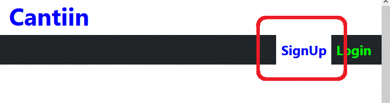
On clicking this button:


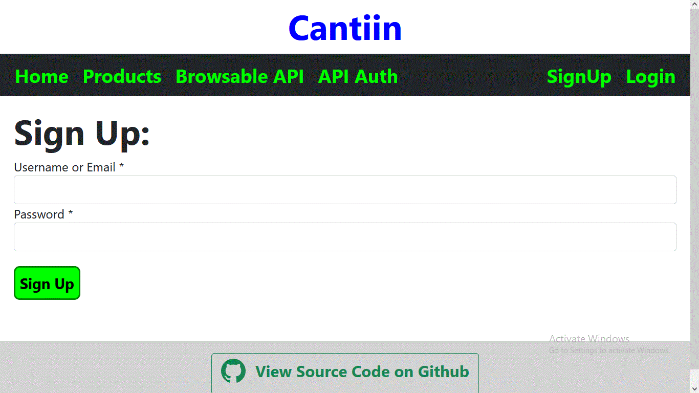

The user will be redirected to the sign up form.


### C-A-2) Logging In:


Just like Sign ing up, there is a log in Button that appears 
when the user is not logged in.


### C-A-3) After Logging In:

After loggin in, the header will change.
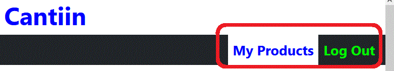  
It will have 2 Options:
1. **My Products**: To display a list of user's products
2. **Log Out**: To log out of the system


## C-B) My Products:

### C-B-1) My products List:

If you are loggin in, you will notice that the header 
has a My Products option.  

    


When You click on the button, you will be reditected to the 
My Products page.  
This page displays a list of products that you have created, 
There is pagination to see the next products.
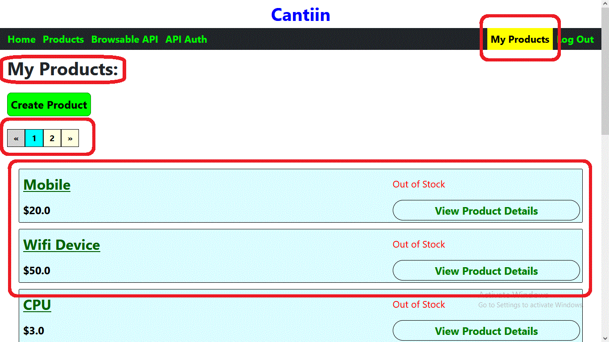       


### C-B-2) Create Product:

On the top of My products page, there is a Craete Product button.  


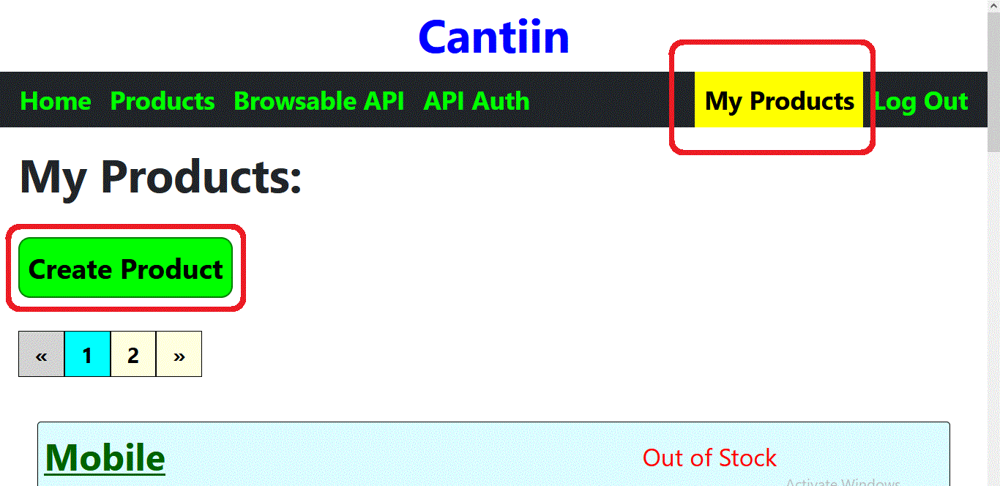       


When you Click on that Button, You will be taken to the Create Product Form.

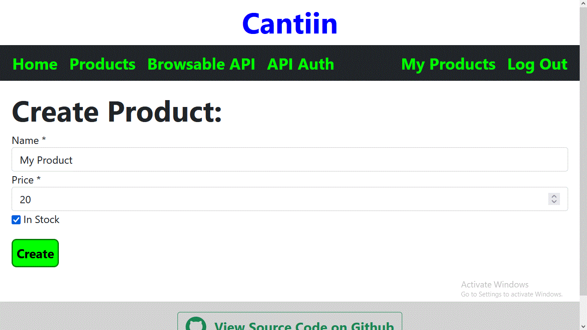       


There is validation, Be Careful :) :

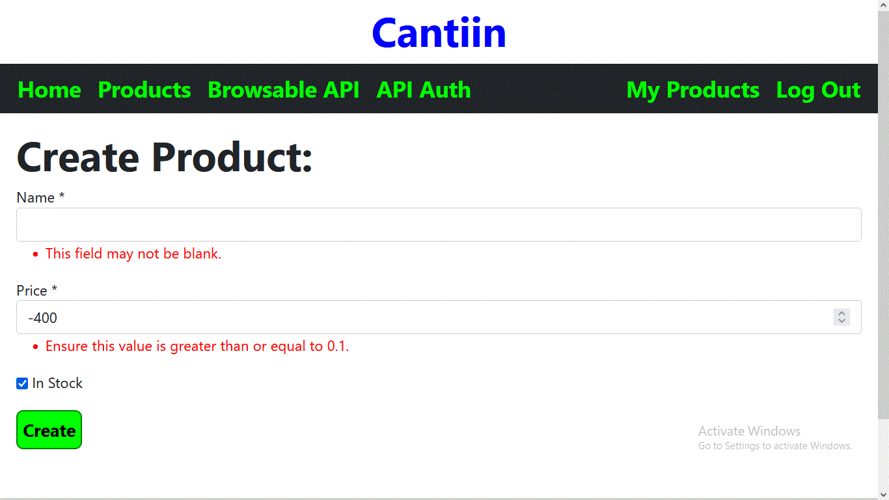       
       


### C-B-3) Product Details:

On My Products page, You will find a list of Products.  
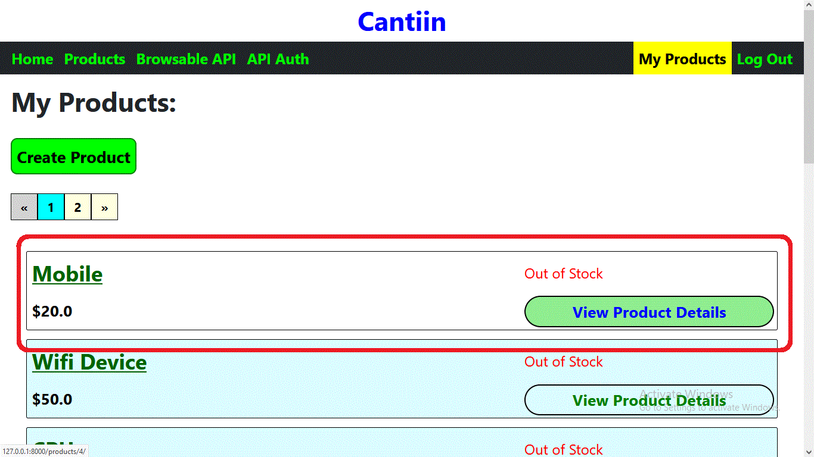       


When you CLick on the View Product Details in the card, 
you will be able to see all the details of the product
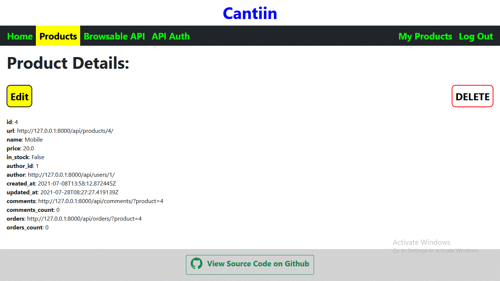       


### C-B-4) Product Delete and Update:


On the product details page, You can Delete the product or edit it 
(If you are the one who posted it).  


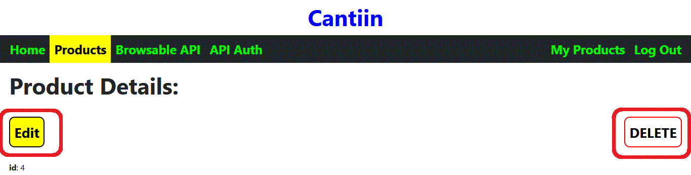       


But If the product was not Your's, then you can not edit it.
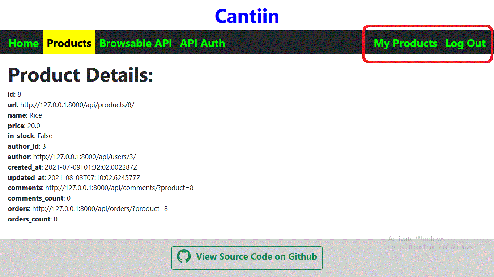       

As in this image, the user is logged in, 
but there is no delete or edit buttons.


# D) Backend:

## D-1) Authentication:

The system uses Django authentication system.  
To use the authentication system you can use this link:
http://127.0.0.1:8000/api/auth/users/  
Here there are djoser endpoints.
This is a the <a href="https://djoser.readthedocs.io/en/latest/base_endpoints.html">documentation</a> of these endpoints.  


The endpoints of authentication are there.  
Authentication is made by cookie if you want to extend the application using the same origin.  
And it also uses auth header if you want to extend the application 
with different origin.  
Authentication uses JWT.


## D-2) What the app does:

Beyound authentication, the app has three more models.  
- Product (Where the users can handle products)
- Order (Where the user can orders of products)
- Comment (Where the user can handle comments on products)


These are the endpoints of API recources:  
"users": "http://127.0.0.1:8000/api/users/" (This is different from auth endpoints)  
"products": "http://127.0.0.1:8000/api/products/"  
"orders": "http://127.0.0.1:8000/api/orders/"  
"comments": "http://127.0.0.1:8000/api/comments/"


## D-3) Pagination:
All the models have pagination.  
Since it exists in the `settings.py` file.  
The pagination uses pages.  
Each page has 10 records.  


## D-4) Validation and Sanitization:
Validation and is used here, it is built in django  and Django REST framework.  
Because we are using Django REST Framework serialization.  
When the user sends a wrong request, the correct response will be returned.


## D-5) Rate Limit:
It means the limit of requests that can be sent bu the users.  
It is very helpful to prevent DoS attacks.  
For users that are 
- logged in: 1000 request/min/IP Adress
- not logged in: 100 request/min/Users


These can be changed by changing `settings.py`.

## D-6) Permissions:
- Not Logged in Users:
	- Create an account (Sign up)
	- Sign in
	- View all data of the API (Users (Username, id, products, and comments), Products, Comments and Orders )
- Logged in Users:
	- Not Logged in users permissions
	- Create a Product, Order or leave a comment on a product
	- Update or delete a product, comment, or order only if it was posted by this certain user.
- Admins (Super users):
	- Logged in users permissions 
	- Update, delete any product, Comment or order posted by any other user.

## D-7) Search:
Search is done using Django Filter:


## D-8) Custom Authentication Endpoints:


### D-8-1) http://127.0.0.1:8000/api/auth/custom/login/

This is the login endpoint.  
The method is POST.  
It expects 2 inputs in the request body: **`username`** and **`password`**


### D-8-2) http://127.0.0.1:8000/api/auth/custom/logout/

This is the logout endpoint.  


### D-8-3) http://127.0.0.1:8000/api/auth/custom/user/

This endpoint tells whether the user is authenticated or not.  
- **Authenticated**: 
	- response:
		- Status Code: 200
		- Body: the user information
- **UnAuthenticated**:
	- response:
		- Status Code: 401


