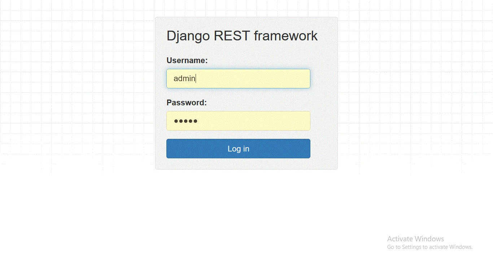
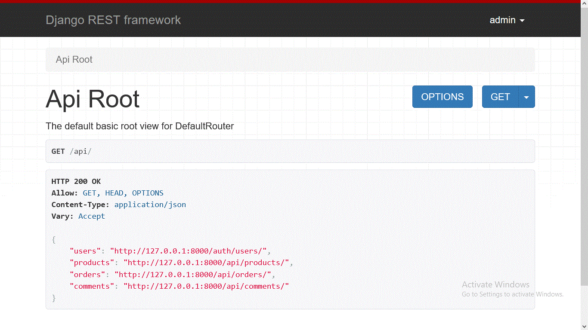
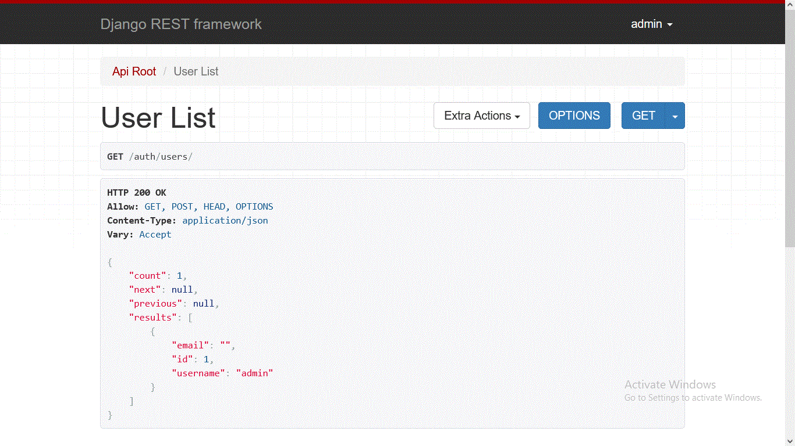

# cantiin_django
An ecommerce website using django and Django REST Framework

# Models:

## 1) Authentication Models:
The built-in auth models of Django.

## 2) Product:

It has these fields:
1. **author_id**: 
	- **Description**: This is the id of the user who posted the product
	- **Type**: int, ForeignKey
	- required	- 
2. **created_at**: 
	- **Description**: The time of the creation of the product
	- **Type**: datetime
	- Auto generated
3. **updated_at**: 
	- **Description**: The time of the last update of the product
	- Auto generated
4. **name**: 
	- **Description**: name of the product
	- **Type**: string
	- required
	- **max length**: 150 characters
5. **price**: 
	- **Description**: price of the product
	- **Type**: float
	- required
	- **max value**: 1000 000
	- **min value**: .1
6. **in_stock**: 
	- **Description**: is the product in stock or out of stock
	- **Type**: boolean
	- required

## 3) Order:

It has these fields:
1. **author_id**: 
	- **Description**: This is the id of the user who created the order
	- **Type**: int, ForeignKey
	- required	- 
2. **created_at**: 
	- **Description**: The time of the creation of the order
	- **Type**: datetime
	- Auto generated
3. **updated_at**: 
	- **Description**: The time of the last update of the order
	- Auto generated
4. **product_id**: 
	- **Description**: id of the product related to teh order
	- **Type**: int, ForeignKey
	- required
5. **amount**: 
	- **Description**: amount of the products of the order
	- **Type**: int
	- required
	- **max value**: 1000
	- **min value**: 1

## 4) Comment:

It has these fields:
1. **author_id**: 
	- **Description**: This is the id of the user who created the comment
	- **Type**: int, ForeignKey
	- required	- 
2. **created_at**: 
	- **Description**: The time of the creation of the comment
	- **Type**: datetime
	- Auto generated
3. **updated_at**: 
	- **Description**: The time of the last update of the comment
	- Auto generated
4. **product_id**: 
	- **Description**: id of the product related to teh comment
	- **Type**: int, ForeignKey
	- required
5. **content**: 
	- **Description**: The content of the comment
	- **Type**: string
	- required
	- **max length**: 1000

